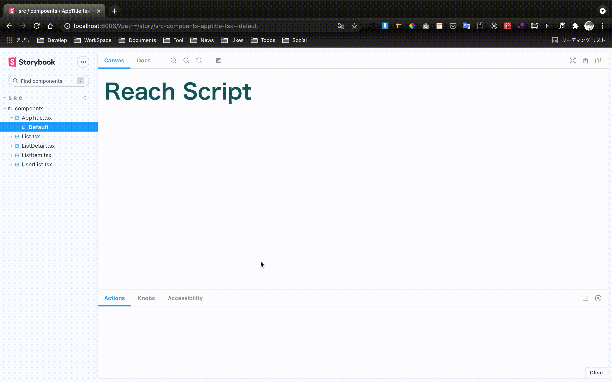
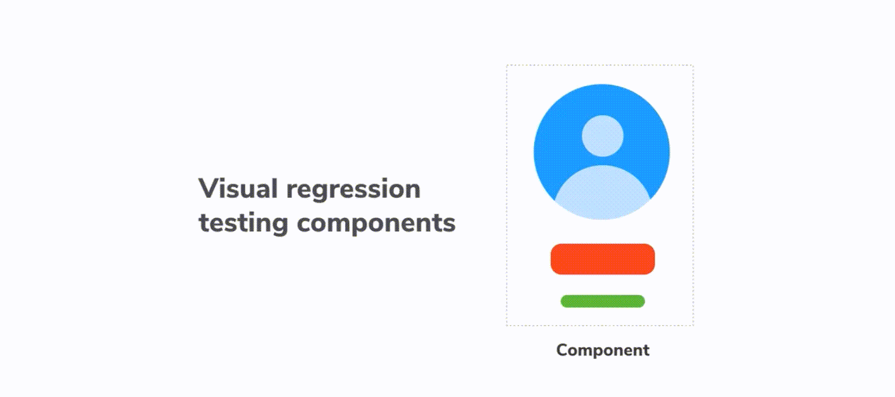
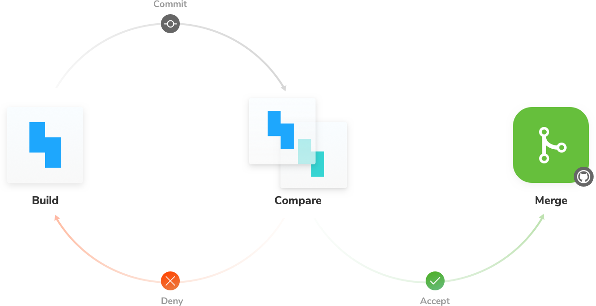

# サンプル: Next.js + TypeScript + Storybook

- [Storybook](https://606c1a499e0b0a0021a0b55c-rgucjhnali.chromatic.com/?path=/story/src-compoents-apptitle-tsx--default)
- [Vercel](https://next-story-book.vercel.app/)

## 概要
>Storybookは、React、Vue、AngularなどのUIコンポーネントを分離して開発するためのオープンソースツールです。これにより、見事なUIを整理して効率的に構築できます。[公式ドキュメント](https://storybook.js.org/)

>Storybook は開発時にアプリケーションと並行して動きます。Storybook を使用することで、UI コンポーネントをビジネスロジックやコンテキストから切り離して開発できるようになります。[公式チュートリアル](https://storybook.js.org/tutorials/intro-to-storybook/react/ja/get-started/)

<br />
<br />

## とりあえず動かしてみる
```bash
git clone https://github.com/mizushima1226/next-story-book.git
yarn install
```

[http://localhost:6006/?path=/story/src-compoents-apptitle-tsx--default](http://localhost:6006/?path=/story/src-compoents-apptitle-tsx--default)

- `UserList.tsx`と`UserList.stories.tsx`がいい参考になるかも👀

<br />
<br />

## できること

### 1.各コンポーネントのカタログを作れる
- １箇所で全てのコンポーネントの見た目を確認できるのでレビューとかしやすい
- 「読み込み中の時」「エラーの時」など状態を作り出してUIを確認できるのでテストしやすい



<br />
<br />

### 2.アドオンを追加すると「スナップショッとテスト」が作成できる
- チュートリアルのReactプロジェクトで作成したので本サンプルでも導入したい

[参考：公式チュートリアル(単純なコンポーネント)](https://storybook.js.org/tutorials/intro-to-storybook/react/ja/simple-component/)
<br />
<br />

### Jestによる単体テスト
- チュートリアルのReactプロジェクトで確認済み。後日、本サンプルにもJestを導入→動作確認

[参考：公式チュートリアル(複合的なコンポーネント)](https://storybook.js.org/tutorials/intro-to-storybook/react/ja/composite-component/)
<br />
<br />

### 3.ビジュアルテストができる
- レイアウトや色、サイズ、コントラストなどの見た目の変更を検出できる
- 本サンプルには未導入。今後導入したい。



<br />
<br />

## やりたいこと
スナップショットテスト、単体テスト、ビジュアルテストの３つのテストをCI(GitHubAction)に追加する
